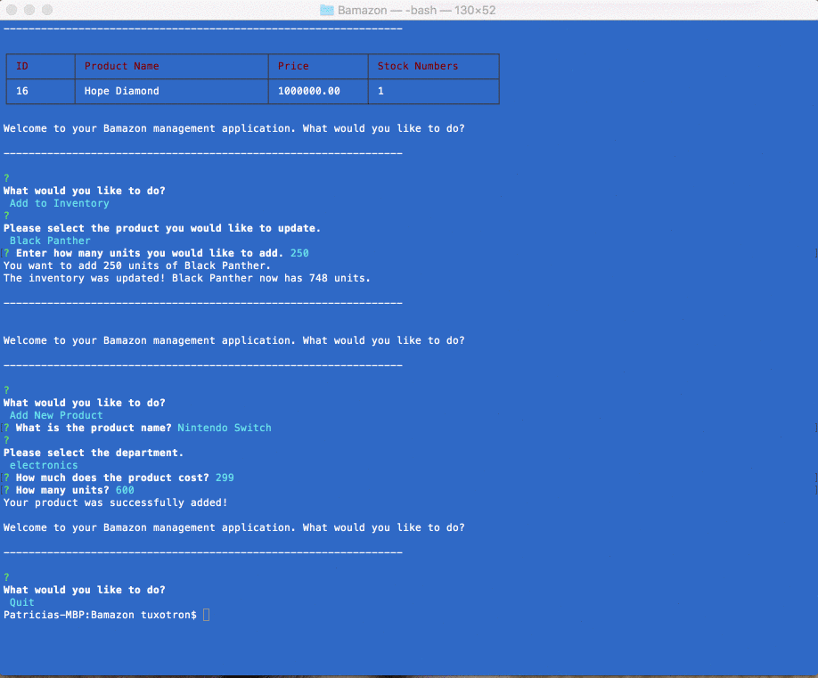
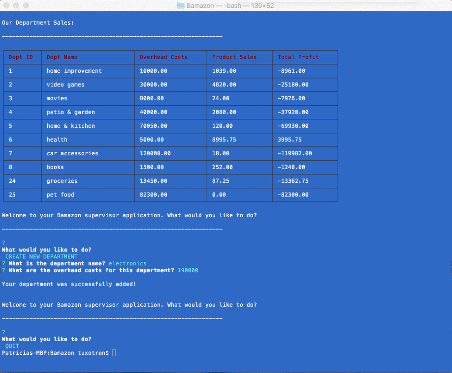
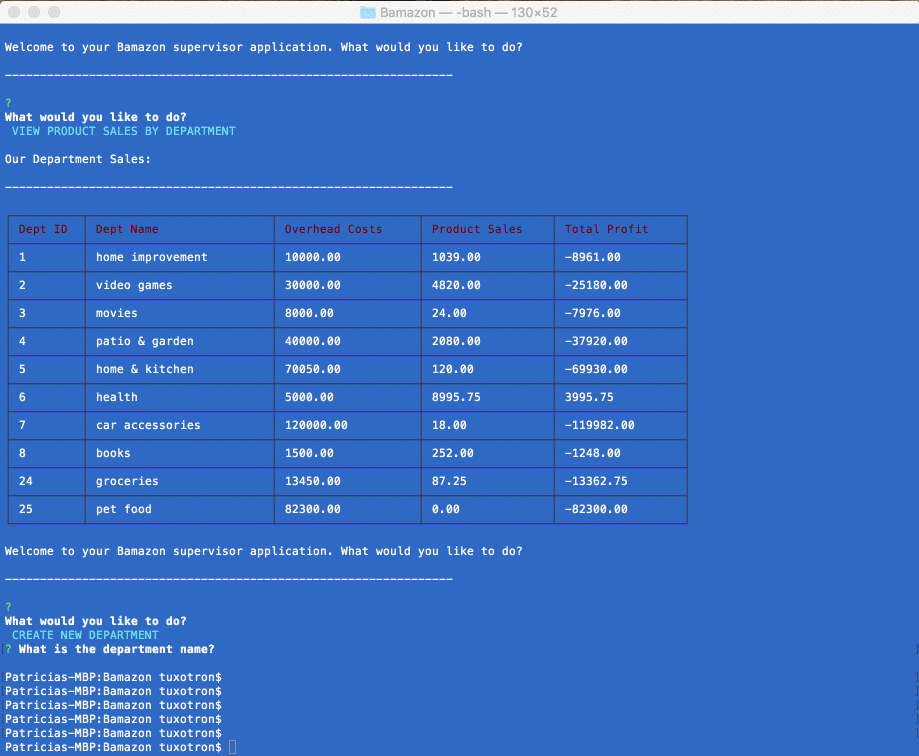

# Bamazon

Your ultimate shopping experience!

Bamazon is an Amazon-like storefront CLI - Node app created with MySQL and JavaScript.

This app has three modes: 

1. Customer 
2. Manager
3. Supervisor

- - -

## Customer

When the customer activates the bamazonCustomer.js app, the following will happen:

* Choose a product

* Choose how many units to purchase

* Receive purchase total

- - - 

## Manager

The bamazonManager.js app will allow 'managers' to edit and add new entries into the database:

* View Products for Sale

* View Low Inventory

* Add to Inventory

* Add New Product

- - - 

## Supervisor

This app requires a new table to display department information and joins with the products table to obtain total profits for Bamazon. The bamazonSupervisor.js app allows 'supervisors' to do the following:

* View Product Sales by Department

* Create New Department

